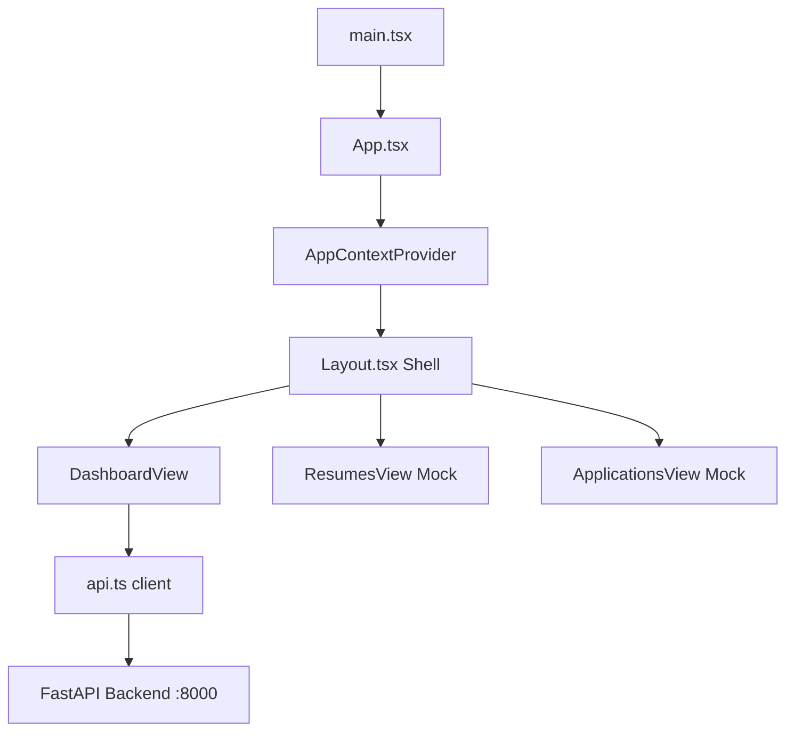

# JobSphere — Active Job Pipeline Dashboard

JobSphere is a production-grade, high-performance web application designed to track, query, search, and manage high-priority job opportunities from multiple platforms. By providing a clean, responsive pipelines board with multi-facet filters and detailed drawer inspects, JobSphere streamlines job searches and application tracking for professionals.

---

## 🚀 Tech Stack

| Technology Layer | Tool / Library | Purpose / Notes |
| :--- | :--- | :--- |
| **Framework & Language** | React 19, TypeScript | Core application runtime & strict type-safety. |
| **Build System** | Vite 8 | Ultra-fast Hot Module Replacement (HMR) and optimized rollup production bundles. |
| **State Management** | React Context API | Centralized, reactive state provider (`AppContext.tsx`) managing job filters, query queries, active tabs, loader animations, and pagination state. |
| **API Client** | Native Fetch Wrapper | Custom type-safe request helper (`api.ts`) with automated query string serialization, response mapping, and status validation. |
| **Styling Framework** | Tailwind CSS v4 + Vanilla CSS | Atomic utility styling, CSS-variable customized theme specifications, and keyframe fluid micro-animations. |
| **Typography** | Google Fonts (Outfit & Inter) | Elegant layout presentation (*Outfit* for headings, *Inter* for body copy). |
| **UI Icons** | Lucide React | Clean, scalable vector system icons representing navigation links, search actions, and chevron drops. |
| **Utility Packages** | `clsx` & `tailwind-merge` | Standard className combination helper function (`cn`) to cleanly override and combine dynamic conditional Tailwind classes. |
| **Linter / Quality Tools**| ESLint 10, TypeScript-ESLint | Strict formatting enforcement and verbatim module syntax checks. |

---

## ✨ Features

- **Active Jobs Metric Indicator**: Live count dashboard badge reflecting active pipelines.
- **Facet Dropdown Filtering**: Narrow down results by **Source** (LinkedIn, Indeed, SearxNG), **Job Type** (Remote, Hybrid, On-site, Full-time, etc.), and custom text input **Location**.
- **Debounced Smart Search**: 400ms input debounce delay preventing redundant API triggers and optimizing backend performance.
- **Dynamic Sort Controls**: Fast client-directed sorting (Date Created, Job Title, Company) with responsive direction toggles.
- **Visual Badge Systems**: Highly recognizable color-coded visual indicator badges (pills style) representing job sources and workspace setups.
- **Slide-Out Details Drawer**: Interactive inspect drawer detailing core job descriptions, salaries, skills list tags, and outbound direct application URLs.
- **Resume uploading & Tracker Mockups**: Comprehensive views supporting resume uploads and application timelines to provide a complete platform preview.

---

## 🏗️ Project Architecture Overview

JobSphere is built using **Feature-Based Architecture** patterns. This methodology ensures logical grouping, maintainability, and clean separation of concerns.



### Component Strategy & Flow
1. **App Shell**: The main `Layout.tsx` wraps pages inside a global navbar shell, providing a navigation framework.
2. **Asynchronous State flow**: State is centralized in `AppContextProvider`. Changes to filters, search text, or page indicators immediately trigger a debounced fetch from the API.
3. **Data Serialization**: The `api.getJobs` wrapper formats filtering parameters into URL search queries, queries `GET /api/v1/jobs/jobs`, parses responses, and updates Context stores.
4. **Verbatim Imports**: Strictly uses type-only imports (`import type { ... }`) for TypeScript type declarations to comply with bundler standards and minimize output build footprint.

---

## 📂 Folder Structure

The frontend code resides in the `/src` directory organized as follows:

```bash
src/
 ├── components/
 │    └── layout/
 │         └── Layout.tsx         # Global responsive container & header navbar navigation
 ├── config/
 │    └── env.ts                 # Runtime environment variable validation and safety checks
 ├── context/
 │    └── AppContext.tsx         # Central React Context managing states, sorting filters & API calls
 ├── features/                   # Feature-based folder structure
 │    ├── applications/
 │    │    └── ApplicationsView.tsx  # Interactive applications tracker view
 │    ├── dashboard/
 │    │    └── DashboardView.tsx     # Main Pipeline page: search inputs, filters & detail drawer
 │    └── resumes/
 │         └── ResumesView.tsx       # Resume upload area and parsing info cards
 ├── services/
 │    └── api.ts                 # Native fetch API request service wrapper
 ├── types/
 │    └── index.ts               # Shared TypeScript schemas matching backend FastAPI models
 ├── utils/
 │    └── cn.ts                  # Classname merging utility using clsx & tailwind-merge
 ├── App.tsx                     # Entry View Switcher component wrapping Layout
 ├── index.css                   # Global styles & Tailwind CSS v4 variables configuration
 └── main.tsx                    # Bootstrapper rendering App within StrictMode
```

---

## 🛠️ Environment Configuration

The application requires the target backend URL configured at build/runtime.

1. Copy `.env.example` to create your local variables:
   ```bash
   cp .env.example .env
   ```
2. Configure variables accordingly:
   ```env
   VITE_API_URL=http://localhost:8000
   ```

---

## 🚀 Available Scripts

In the `frontend` root directory, you can run the following package commands:

| Command | Action |
| :--- | :--- |
| `npm install` | Installs project dependencies. |
| `npm run dev` | Spins up the local Vite development server at `http://localhost:5173/`. |
| `npm run build` | Compiles the project using TypeScript compilation (`tsc`) and builds production distribution assets in the `/dist` directory. |
| `npm run lint` | Runs ESLint analysis checks across the codebase. |
| `npm run preview` | Serves the locally compiled production bundle for preview. |
